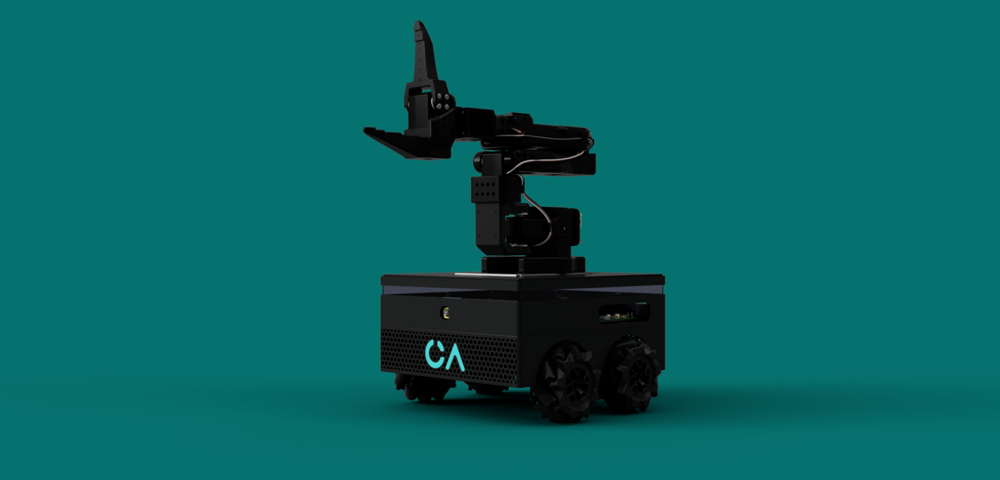
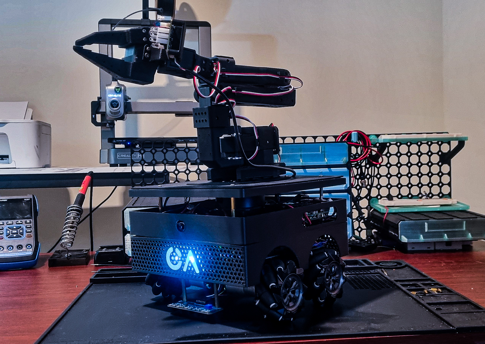
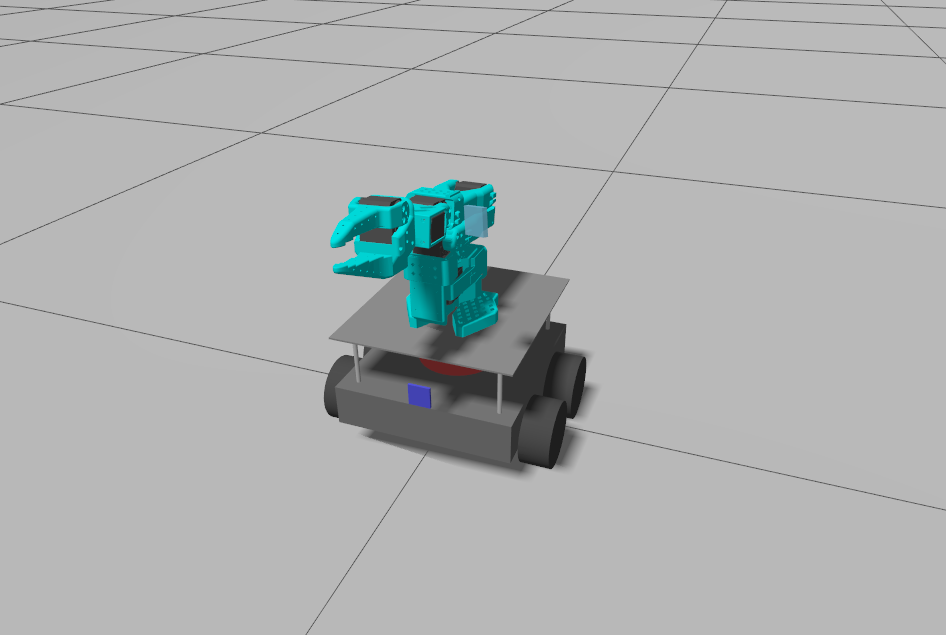
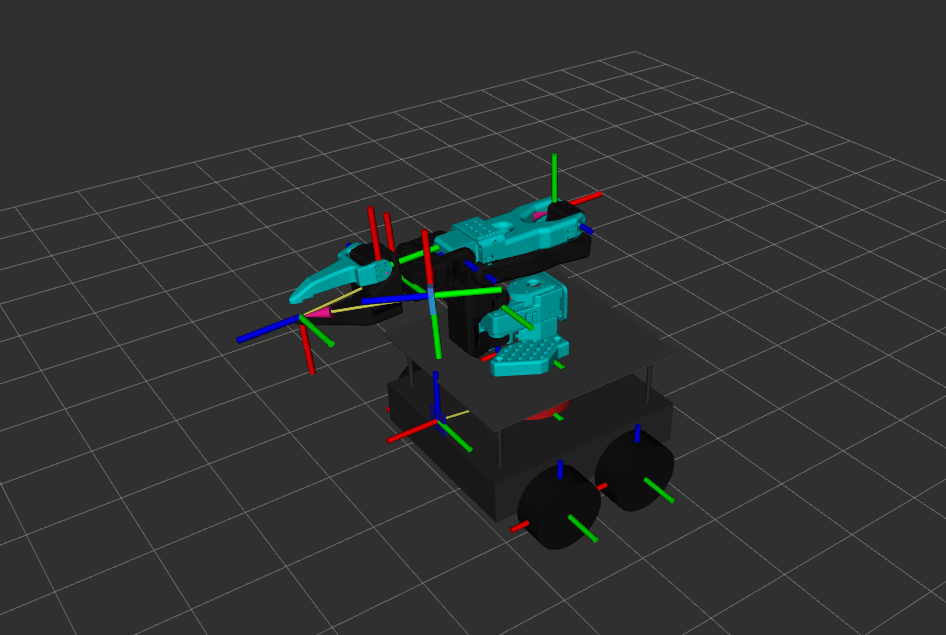
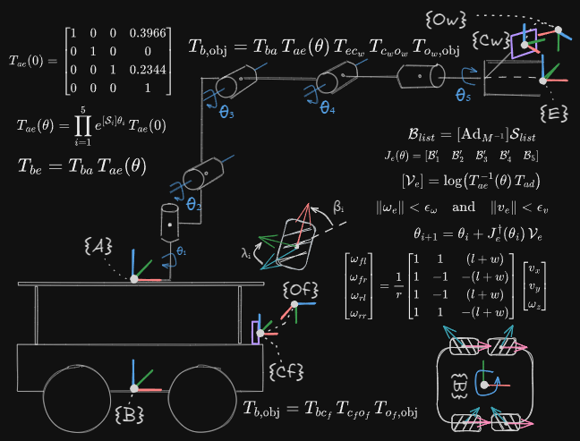
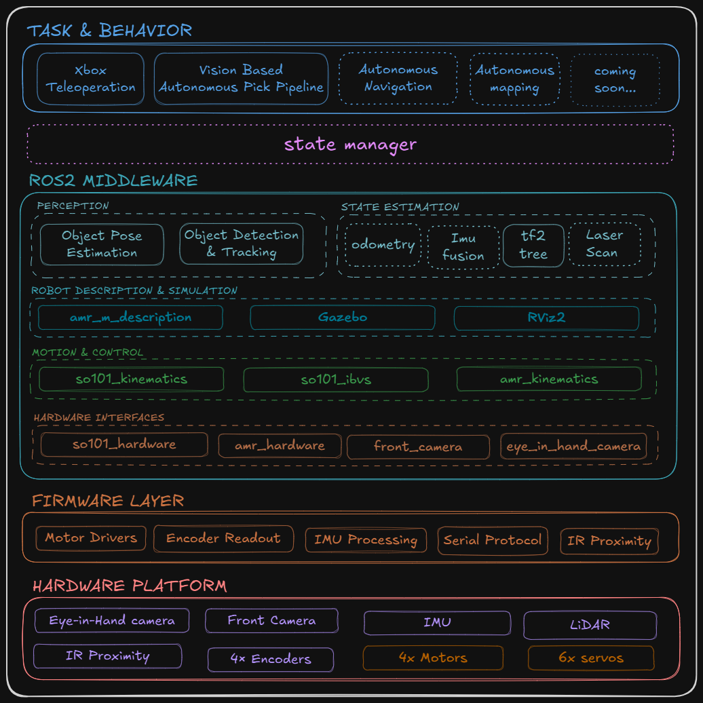

# GENESIS_AMR_M

# Hi! Significant improvements have been made to this project. Please check my LinkedIn https://www.linkedin.com/in/jacquet-daniel/ for updates while I polish the codebase before pushing it to this repository. 😉

An autonomous mobile robot with a 5-DOF manipulator, designed as a comprehensive exploration of core robotics concepts. This project implements everything from low-level register programming to high-level vision-language-action (VLA) systems.

## **Current Capabilities**

See demo : https://drive.google.com/drive/folders/1hUCp3poNAlBxnC5ldVQJObooRF3JIzBk?usp=sharing

## Workbench🙂

## Gazebo view

## Rviz view

## sprinkle of math

## Code Architecture Overview

### Mobile Platform

- **Teleoperation**: Omnidirectional movement with Xbox controller, live video feedback via MediaMTX, and pan-tilt first-person view control
- **"Good Boy" Mode**: Autonomous search and retrieval of a green ball using omnidirectional movement and pan-tilt camera tracking.

### Manipulator

- **Servo-to-Joint Space Mapping**: Translates and constrains commands from joint space to servo space, handling centering, range limits, and register communication
- **Forward Kinematics**: Complete kinematic chain implementation
- **Inverse Kinematics**: Analytical or numerical IK solver for end-effector positioning
- **Blind Pick-and-Place**: Path interpolation for automated manipulation tasks
- **GUI Control & Visualization**: Real-time workspace visualization with joint control, pose goals, and mathematical space representation
- **Ball Pose Estimation**:  3D position estimation
- **Image-Based Visual Servoing (IBVS)**: Vision-guided manipulation control

  
## **In Development (Coming Soon)**

### Mobile Platform

- **Autonomous Mapping**: Frontier exploration with A* or RRT* path planning (toggling based on environment structure; RRT* offers faster performance but struggles in tight spaces). *Simulation complete, implementation in progress.*
- **Autonomous Navigation + Obstacle Avoidance**: A* for global path planning with RRT* for dynamic replanning around static obstacles. *Simulation complete, implementation in progress.*
- **Restructuring the power system to enhance vibration resistance, optimize power distribution, and improve battery management.**

### Manipulator

-- **object pose estimation, classification, and segmentation using YOLO and custom-trained models.**

## **Future Roadmap**

- **ML-Based Perception**: Object segmentation and classification using machine learning for advanced pick-and-place operations
- **Learning-Based Control**: Machine learning and reinforcement learning approaches for dexterous manipulation

---

_This project represents a complete robotics system built from first principles, providing hands-on experience with embedded systems, kinematics, path planning, Machine vision, and autonomous behaviors._
