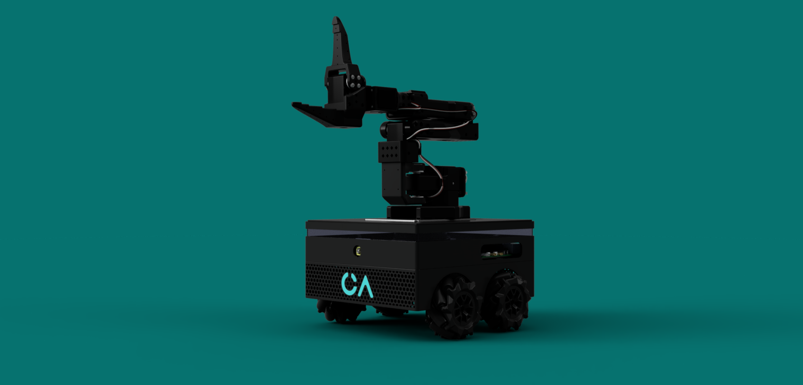
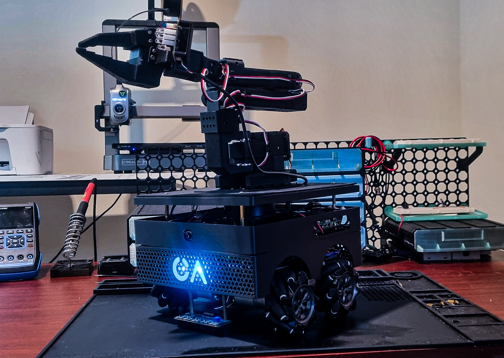
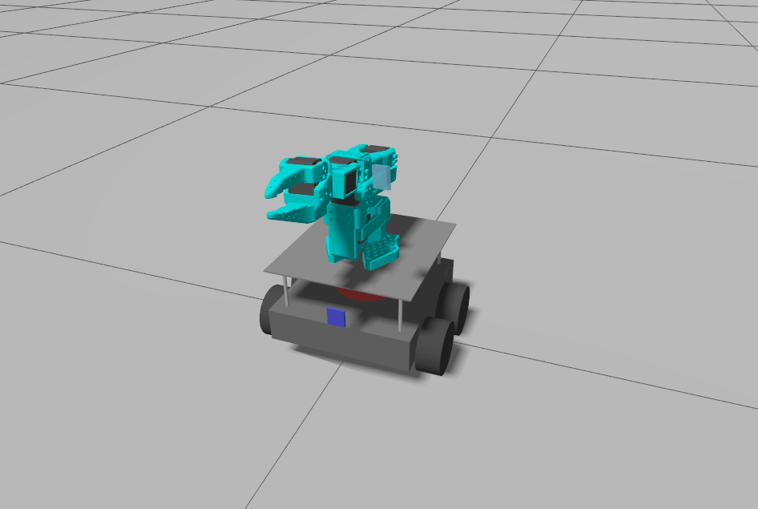
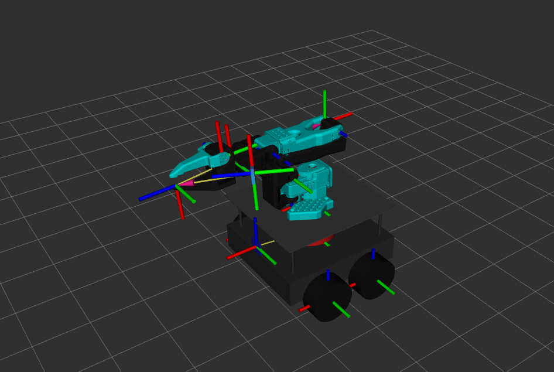
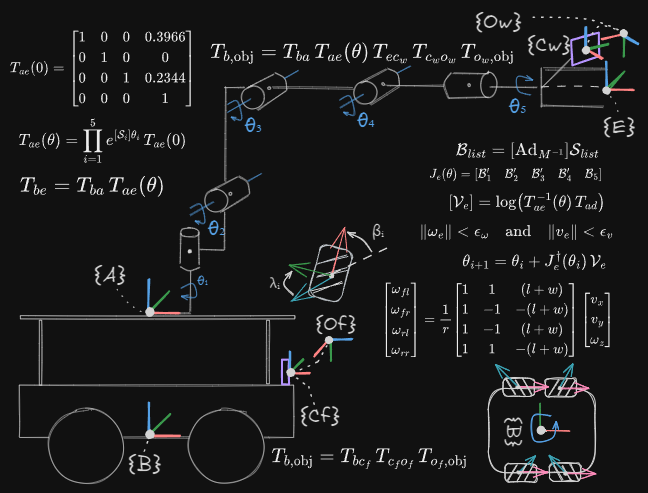
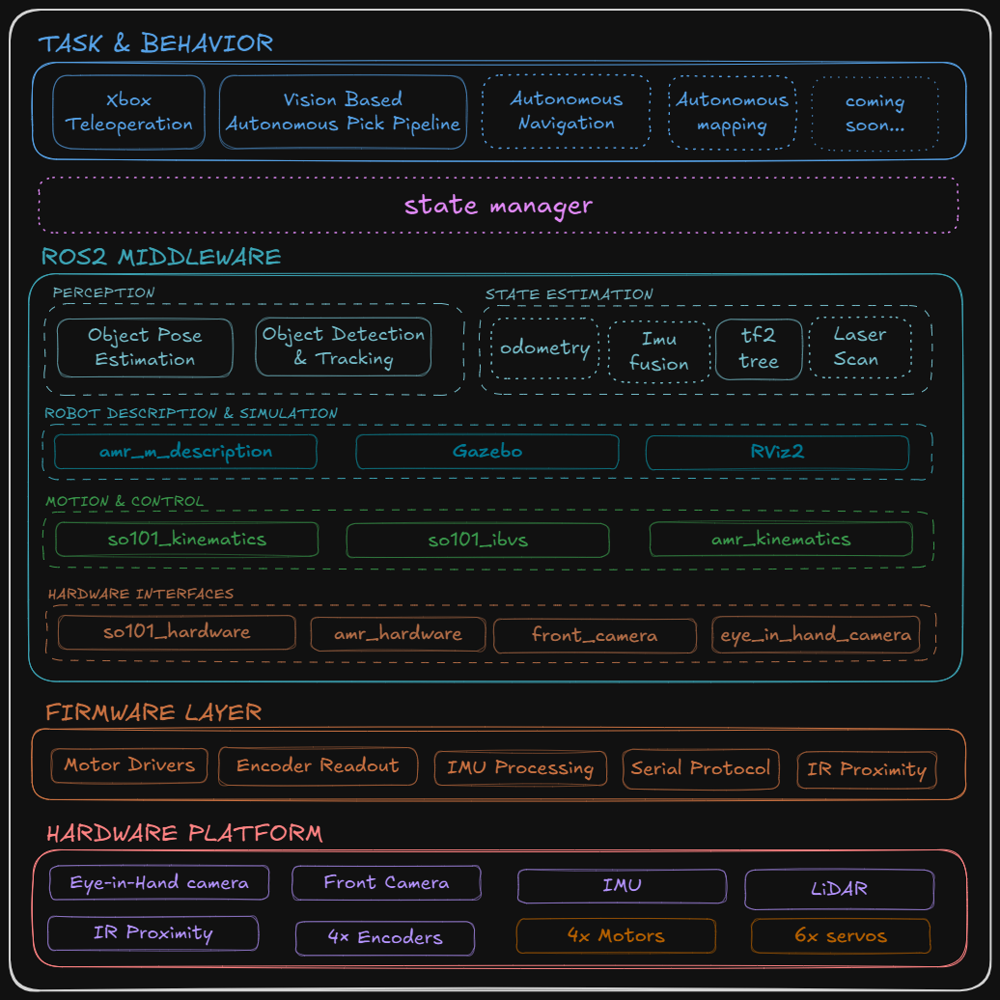

# GENESIS_AMR_M

> [!NOTE]
> Significant improvements have been made to this project! For more regular updates, please check the [documentation](https://danieljacquet.com/genesis_bot/). 😉

An autonomous mobile robot with a 5-DOF manipulator, designed as a comprehensive exploration of core robotics concepts. This project implements everything from low-level register programming to high-level vision-language-action (VLA) systems.

See demo : https://www.youtube.com/shorts/ray84zgngtU

Every subsystem is documented with the theory, the math, and the implementation. The goal: a single platform where every major robotics concept can be studied, built, and tested, end to end.

---

## What's Inside

| Layer | Concepts Covered |
|---|---|
| **Embedded / Firmware** | Register-level servo control, ESP32 bare-metal drivers, BMS & power architecture |
| **Kinematics** | FK, IK (analytical + Newton-Raphson), servo ↔ joint space mapping, workspace visualization |
| **Mobile Base** | Mecanum wheel kinematics, wheel PID, omnidirectional teleoperation |
| **Perception** | Pinhole model, back-projection, depth recovery, hand-eye calibration, 3D pose estimation |
| **Autonomy** | SLAM, frontier exploration, A\* global planning, RRT\* dynamic replanning |
| **Visual Servoing** | IBVS and PBVS closed-loop manipulation |
| **AI / Learning** | VLA data collection pipeline, imitation learning, future RL integration |

> **Philosophy:** every abstraction is earned. If a concept is used, the documentation shows where it comes from.

---
## System Modules

### Mobile Base
Omnidirectional 4-wheel mecanum drive with full teleoperation and autonomous modes.

- Xbox controller + MediaMTX live video stream
- Pan-tilt first-person view
- **Good Boy Mode** : autonomous search and retrieval of a green ball
- Frontier-based autonomous mapping *(in progress)*
- A\* global planning + RRT\* dynamic replanning *(in progress)*

---

### Manipulator
5-DOF SO-101 arm with full kinematic chain and vision-guided control.

- Servo-to-joint space mapping with range limiting and register communication
- Forward kinematics : full chain implementation
- Inverse kinematics : analytical and Newton-Raphson numerical solver
- Blind pick-and-place with path interpolation
- GUI control with real-time workspace visualization
- 3D ball pose estimation
- **IBVS** : Image-Based Visual Servoing
- **PBVS** : Position-Based Visual Servoing

---
### Perception
Camera model foundations through 3D object pose estimation.

- Pinhole camera model and projection math
- Back-projection and depth recovery
- Hand-eye calibration
- Object detection and 3D pose estimation

---

### Navigation & SLAM
Autonomous mapping and obstacle-aware path planning.

- LiDAR-based SLAM
- Frontier exploration
- A\* for global path planning
- RRT\* for dynamic replanning around obstacles
- *(Simulation complete : hardware implementation in progress)*

---
### Hardware & Power
Electrical architecture, mechanical build, and BOM.

- 2× 4S 18650 packs : one dedicated to hardware motors and actuators, one to logic (RPi5 + ESP32)
- Per-rail buck converters
- Wiring diagrams and schematics
- *(Power system restructure in progress for improved vibration resistance)*

---
### Learning & VLA
Data collection through autonomous skill acquisition.

- VLA data collection pipeline
- Imitation learning setup
- YOLO-based object classification and segmentation *(planned)*
- RL-based dexterous manipulation *(planned)*

---
## Implementation Status (Builder version)
> *Last updated: March 18, 2026*

| Subsystem     | Feature                                        | Status |
| ------------- | ---------------------------------------------- | :----: |
| Firmware      | Register-level PWM + motor driver interface    |   ✅    |
| Firmware      | Hardware quadrature encoder reading (PCNT)     |   ✅    |
| Firmware      | Wheel PID (anti-windup, derivative filter ...) |   ✅    |
| Firmware      | ESP32 ↔ RPi5 serial communication protocol     |   ✅    |
|               |                                                |        |
| Mobile Base   | Mecanum kinematics (FK + IK)                   |   ✅    |
| Mobile Base   | Wheel odometry + TF2 broadcast                 |   🔧   |
| Mobile Base   | IMU integration + EKF sensor fusion            |   🔧   |
| Mobile Base   | Good Boy autonomous ball retrieval             |   ✅    |
| Mobile Base   | Frontier exploration + SLAM                    |   🔧   |
| Mobile Base   | A\* / RRT\* autonomous navigation              |  🗓️   |
| Mobile Base   | Obstacle detection                             |  🗓️   |
| Mobile Base   | Power system restructure                       |   🧪   |
|               |                                                |        |
| Manipulator   | Servo ↔ joint space mapping                    |   ✅    |
| Manipulator   | Forward kinematics (PoE)                       |   ✅    |
| Manipulator   | Analytical + Newton-Raphson IK                 |   ✅    |
| Manipulator   | GUI + workspace visualization                  |   ✅    |
| Manipulator   | Open-loop pick-and-place                       |   ✅    |
| Manipulator   | IBVS + PBVS visual servoing                    |   ✅    |
| Manipulator   | 3D ball pose estimation                        |   ✅    |
| Manipulator   | MoveIt2 integration + ros2_control bridge      |  🗓️   |
| Manipulator   | Collision + self-collision avoidance           |  🗓️   |
| Manipulator   | Grasp planning                                 |  🗓️   |
| Manipulator   | Whole-body coordination (base + arm)           |  🗓️   |
| Manipulator   | YOLO object classification + segmentation      |  🗓️   |
|               |                                                |        |
| Perception    | Camera intrinsic calibration                   |   ✅    |
| Perception    | Hand-eye calibration                           |   ✅    |
| Perception    | LiDAR integration + scan filtering             |   ✅    |
| Perception    | Depth camera pipeline                          |  🗓️   |
| Perception    | 6-DOF object pose estimation                   |   🔧   |
|               |                                                |        |
| Teleoperation | Gamepad teleop (base + arm )                   |   ✅    |
| Teleoperation | MediaMTX live video stream                     |   ✅    |
| Teleoperation | Custom handheld controller (6-DOF + screen)    |  🗓️   |
| Teleoperation | Leader-follower arm teleoperation              |  🗓️   |
| Teleoperation | Phone / web teleoperation                      |  🗓️   |
| Teleoperation | VR teleoperation (Quest 3)                     |  🗓️   |
|               |                                                |        |
| System        | Zenoh distributed compute (RPi5 ↔ dev machine) |   🧪   |
| System        | rosbag2 logging + telemetry pipeline           |  🗓️   |
|               |                                                |        |
| Learning      | LeRobot data recording pipeline                |  🗓️   |
| Learning      | VLA data collection pipeline                   |  🗓️   |
| Learning      | Imitation learning                             |  🗓️   |
| Learning      | Dataset management + versioning                |  🗓️   |
| Learning      | Sim-to-real transfer                           |  🗓️   |
| Learning      | RL dexterous manipulation                      |  🗓️   |
|               |                                                |        |
| Simulation    | Gazebo + ROS2 integration (URDF, sensors)      |   🧪   |
| Simulation    | MuJoCo digital twin + system identification    |   💭   |
| Simulation    | Isaac Lab parallel env + domain randomization  |   💭   |
| Simulation    | RL policy training (PPO / SAC)                 |   💭   |

✅ Complete · 🧪 Testing · 🔧 In Progress · 🗓️ Planned · 💭 Under Consideration

---

## Hardware Overview

| Component      | Details                                  |
| -------------- | ---------------------------------------- |
| **Compute**    | Raspberry Pi 5 + 2× ESP32                |
| **Arm**        | SO-101 · 5-DOF · Serial servo bus        |
| **Base**       | Mecanum wheels · 4-motor drive           |
| **Sensing**    | Dual RGB cameras · LiDAR·IMU             |
| **Middleware** | ROS 2 Jazzy · Zenoh DDS bridge           |
| **Power**      | 8x18650 · BMS · Per-rail buck converters |

## Workbench🙂

## Gazebo view

## Rviz view

## sprinkle of math

## Code Architecture Overview

---
*Built by **Claude Daniel Jacquet** · MS Robotics, Purdue University* 
